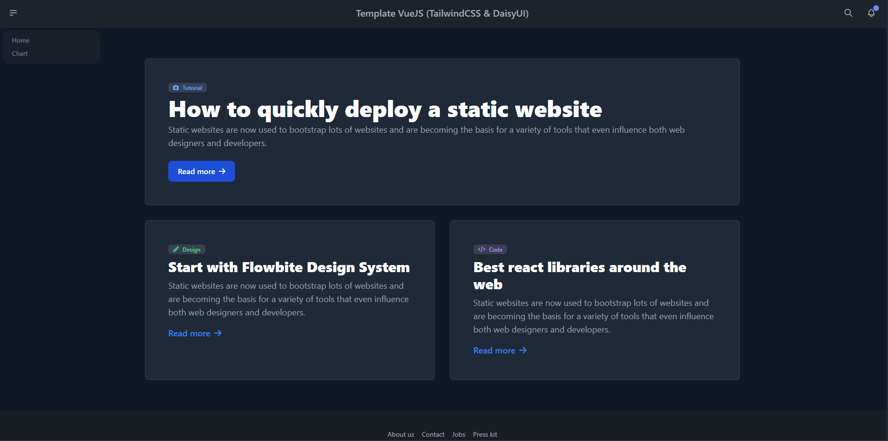
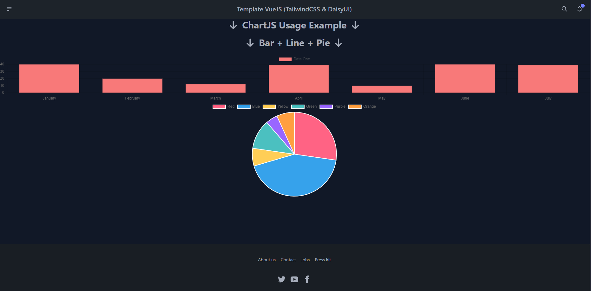

<h1 align="center"> Template VueJS3 with TypeScript </h1> <br>

<p align="center">
This VueJS3 template with TypeScript is designed to simplify the initialization of your next Vue.js projects. It includes a set of commonly used configurations and libraries, enabling you to get started quickly with a solid foundation.
</p>

## Table of Contents

- [Previews](#previews)
- [Features](#features)
- [Structure](#structure)
- [Build Process](#build-process)

## Previews

<details>
  <summary><strong>➡️ View</strong></summary>
  <br/>
  
  
  <br/>
</details>

## Features

- `Vue 3`: The latest version of Vue.js.
- `TypeScript`: For better type management and an improved development experience.
- `Vite`: For fast, high-performance bundling.
- `Vue Router`: For route management.
- `Vuex`: For global state management.
- `Axios`: For HTTP requests.
- `TailwindCSS`: For utilitarian CSS design.
- `DaisyUI`: UI components based on TailwindCSS.
- `FontAwesome`: For icons.
- `Chart.js`: For graphics.
- `ESLint`: For linting.
- `Prettier`: For code formatting.

## Structure

```
frontend/
│
├── assets/
│
├── components/
│ ├── ChartJS/
│ │ ├── ChartBarComponent.vue
│ │ ├── ChartLineComponent.vue
│ │ ├── ChartPieComponent.vue
│ │
│ ├── Footer.vue
│ └── Navbar.vue
│
├── interfaces/
│ └── user.ts
│
├── plugins/
│ └── fontAwesome.ts
│
├── router/
│ └── index.ts
│
├── services/
│ └── userService.ts
│
├── store/
│ └── index.ts
│
├── styles/
│ ├── base/
│ ├── components/
│ ├── layout/
│ ├── pages/
│ ├── utils/
│ ├── index.scss
│ └── main.scss
│
├── views/
│ └── Chart.vue
│ └── Home.vue
│
├── apiAxios.ts
├── App.vue
├── main.ts
├── shims-vue.d.ts
└── vite-env.d.ts
```

## Build Process

### Prerequisites

- Node.js (version 14 or higher)
- npm (version 6 or higher) or yarn

### Steps

1. Clone the repository:

   ```
   git clone https://github.com/KoZeuh/Template-Vue3-TypeScript.git
   cd Template-Vue3-TypeScript
   ```

2. Install the dependencies:

   ```
   npm install
   or
   yarn install
   ```

### NPM Scripts

- `npm run dev` : Starts the development server.
- `npm run build` : Compiles the project for production.
- `npm run preview` : Previews the production build.
- `npm run lint` : Runs ESLint to find and fix problems.
- `npm run format` : Formats the code with Prettier.


----------------------------------------------------------------------------------------------------------------------------------------------------------------------------------------------------------------------------------------------------------


